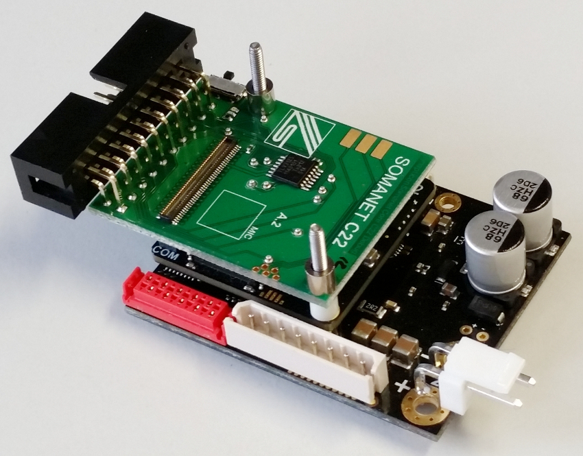

.. _SOMANET_Standalone_Velocity_Control_Demo_Quickstart:

SOMANET Standalone Profile Velocity Control Demo Quick Start Guide
==================================================================

This demonstrative application illustrates usage of ``module_ctrl_loops`` and dependent modules to do a velocity control of a brushless DC motor. The velocity control loop is closed with a velocity feedback calculated from either a Hall or Incremental Encoder (QEI) sensor. 

Hardware setup
++++++++++++++

A minimal requirement for this application to run is having the *SOMANET* stack assembled consisting of the *SOMANET Core-C22*, *SOMANET Core* to xTAG-2 Debug Adapter, and *SOMANET IFM-Drive-DC100/300* modules. The stack should be powered via the *SOMANET IFM* board. An example of an assembled stack is shown in the image below. For the motor supplied with the kit the required power supply voltage should be 24 Volts. For the best experience please make sure that your stabilized DC power supply is capable of delivering more that 2 Amperes of power. Please mind that at high motor accelerations starting current may be as high as 10 times the nominal.     

   Hardware Setup for standalone Torque Control Demo

To setup the system:

   #. If you don't have the stack assembled, assemble it as shown in the image above. Make sure to connect the IFM side of the *SOMANET Core* module to the IFM-DC100/300 board and COM side to the Core Debug Adapter (see markings on the Core module)
   #. Connect the xTAG-2 Adapter to the Core Debug Adapter.
   #. Connect the xTAG-2 to host PC. 
   #. Connect the motor supplied with the kit as shown in the image bellow.
   #. Connect the *IFM-DC100* board to a 24 V DC power supply
   #. Switch on the power supply. If everything is connected properly, drained current should not exceed 100mA. 

.. figure:: images/standalone_motorcontrol.jpg
   :align: center

   Connecting the motor and cables to your kit

Import and build the application
++++++++++++++++++++++++++++++++

   #. Open *xTIMEcomposer* Studio and check that it is operating in online mode. Open the edit perspective (Window->Open Perspective->XMOS Edit).
   #. Locate the ``'SOMANET Standalone Profile Velocity Control Demo'`` item in the *xSOFTip* pane on the bottom left of the window and drag it into the Project Explorer window in *xTIMEcomposer*. This will also cause the modules on which this application depends to be imported as well. 
   #. Click on the ``app_demo_bldc_velocity`` item in the Project Explorer plane then click on the build icon (hammer) in *xTIMEcomposer*. Check the Console window to verify that the application has built successfully. 
   #. Please ignore the warning ``Node "3" does not have 100Mhz reference clock``. This warning is thrown because the tile 3 has 250 MHz reference clock. 

For help in using *xTIMEcomposer*, try the *xTIMEcomposer* tutorial, which you can find by selecting Help->Tutorials from the *xTIMEcomposer* menu.

Note that the Developer Column in *xTIMEcomposer* Studio on the right hand side of your screen provides information on the *xSOFTip* components you are using. Select the ``'SOMANET Motor Control loops'`` component in the Project Explorer, and you will see its description together with API documentation. Having done this, click the `back` icon until you return to this Quick Start Guide within the Developer Column.

Run the application
+++++++++++++++++++

When the application has been compiled, the next step is to run it on the *SOMANET Core* module using the tools to load the application over JTAG (via the xTAG-2 and Core Debug Adapter) into the xCORE multi-core micro-controller.

   #. Select the file ``app_demo_bldc_velocity.xe`` in the ``app_demo_bldc_velocity`` project from the Project Explorer.
   #. Click on the ``Run`` icon (the white arrow in the green circle). 
   #. At the ``Select Device`` dialog, select ``XMOS xTAG-2 connect to L1[0..3]`` and click ``OK``.
   #. The debug console window in *xTIMEcomposer* will not display any message. With the non modified application the rotor of the motor should slowly accelerate reaching 1000 RPM velocity value and continue keeping it. 
   
Next steps
++++++++++

As a next step you can try changing the target velocity in the ``demo-bldc-velocity.xc`` file located in the ``src`` folder of the app. In the function ``profile_velocity_test`` change the variable ``target_velocity`` to some other value within the defined limit in the motor configuration file. The configuration file can be found in the ``config`` directory and is common for all standalone motor control applications. The parameter ``MAX_PROFILE_VELOCITY`` in the ``bldc_motor_config.h`` defines the velocity control limit. 

You might also try varying accelerations and decelerations (``acceleration``, ``deceleration``). The maximum set-point values for the acceleration and deceleration are equal and defined by the ``MAX_ACCELERATION`` parameter in the ``bldc_motor_config.h``.

To get xscope display, enable XScope Real-Time Mode in ``Run Configurations``. You will get ``actual velocity`` and ``target velocity`` displayed in xscope.

Examine the code
................

   #. In *xTIMEcomposer* navigate to the ``src`` directory under ``app_demo_bldc_velocity`` and double click on the ``demo-bldc-velocity.xc`` file within it. The file will open in the central editor window.
   #. Find the main function and note that the application runs one logical core on the COM_TILE (tile 0) for the user motor control application, one logical core on tile 2 for the main velocity control loop, and five cores on the IFM_TILE for commutation, watchdog, and motor feedback sensor servers.
   #. Core 1:  Profile Velocity Test Client function. It implements a user application for the profile velocity control. ::

       profile_velocity_test(c_velocity_ctrl);

   #. Core 2: Velocity Control Loop. This is the main velocity control loop server for cyclic velocity control mode. Some parameters have to be initialized prior starting the controller. ::

       velocity_control(velocity_ctrl_params, sensor_filter_params, hall_params, qei_params, SENSOR_USED, c_hall_p2, c_qei_p2, c_velocity_ctrl, c_commutation_p2);
   
   #. Core 3: PWM Loop. It implements the PWM Server. ::

       do_pwm_inv_triggered(c_pwm_ctrl, c_adctrig, p_ifm_dummy_port, p_ifm_motor_hi, p_ifm_motor_lo, clk_pwm);

   #. Core 4: Motor Commutation loop. The main commutation loop that implements sinusoidal commutation. Some parameters have to be initialized prior starting the loop. ::

       commutation_sinusoidal(c_hall_p1,  c_qei_p1, c_signal, c_watchdog, c_commutation_p1, c_commutation_p2, c_commutation_p3, c_pwm_ctrl, p_ifm_esf_rstn_pwml_pwmh, p_ifm_coastn, p_ifm_ff1, p_ifm_ff2, hall_params, qei_params, commutation_params);

   #. Core 5: Watchdog Server. In case of application crash to prevent the hardware damages this server is required to constantly run. If the server is not running, the motor phases are disabled and no motor commutation is possible. ::

       run_watchdog(c_watchdog, p_ifm_wd_tick, p_ifm_shared_leds_wden);

   #. Core 6: Hall Server. Reads states of the motor Hall feedback sensor and calculates velocity and incremental position. Some parameters have to be initialized prior starting the server. ::

       run_hall(c_hall_p1, c_hall_p2, c_hall_p3, c_hall_p4, c_hall_p5, c_hall_p6, p_ifm_hall, hall_params); 

   #. Core 7: QEI Server. Reads states of an incremental encoder feedback sensor in a quadrature mode and calculates velocity and incremental position. Some parameters have to be initialized prior starting the server. ::

       run_qei(c_qei_p1, c_qei_p2, c_qei_p3, c_qei_p4, c_qei_p5, c_qei_p6, p_ifm_encoder, qei_params);  

Now please have a closer look onto the ``profile_velocity_test`` function that implements the velocity profile and includes a linear ramp generator. First you will find already familiar variables that define desired movement parameters like velocity, acceleration and deceleration. 
 
To start with the motion profile generation you need to call the ``set_profile_velocity`` function. The function takes the desired profile and limiting parameters as input and executes the motion profile.  

You can get the velocity feedback buy calling the ``get_velocity(c_velocity_ctrl)`` method. Please mind that debug console print statements may block execution of your application. Please use XScope instead to monitor the feedback in real-time. 

