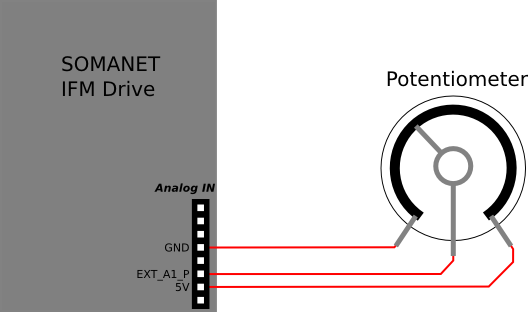

.. _brushed_dc_ext_control_demo:

================================================
Brushed DC Velocity Control with a potentiometer
================================================

.. contents:: In this document
    :backlinks: none
    :depth: 3

With this app (app_demo_brushed_dc_ext_control) it is possible to control the speed/voltage of your Brushed DC motor with the help of a potentiometer.

* **Minimum Number of Cores**: 5
* **Minimum Number of Tiles**: 2

.. cssclass:: github

  `See Application on Public Repository <https://github.com/synapticon/sc_sncn_motorcontrol/tree/master/examples/app_demo_brushed_dc_ext_control/>`_

Hardware setup
==============
To use this app, you need to connect a potentiometer to the Analog IN connector of your SOMANET IFM Drive.
Connect one of the outer contacts to 5V and the other to Ground. The middle contact, the brush, must be connected to a positive analog in connector.
The graphic shows you an example circuit.

Quick how-to
============
1. :ref:`Assemble your SOMANET device <assembling_somanet_node>`.
2. Wire up your device. Check how at your specific :ref:`hardware documentation <hardware>`. Connect your motor phases, power supply cable, and XTAG. Power up!
3. :ref:`Set up your XMOS development tools <getting_started_xmos_dev_tools>`. 
4. Download and :ref:`import in your workspace <getting_started_importing_library>` the SOMANET Motor Control Library and its dependencies.
5. Open the **main.xc** within  the **app_demo_brushed_dc_ext_control**. Include the :ref:`board-support file according to your device <somanet_board_support_module>`. Also set the :ref:`appropriate target in your Makefile <somanet_board_support_module>`.

.. important:: Make sure the SOMANET Motor Control Library supports your SOMANET device. For that, check the :ref:`Hardware compatibility <motor_control_hw_compatibility>` section of the library.

6. In dependencies of how you connected the potentiometer to the analog IN port (A0 or A1), you have to adjust the variable (AI0 or AI1), which contains the ADC value (in line 47).
7. :ref:`Set the configuration <motor_configuration_label>` for Motor Control.
8. :ref:`Run the application <running_an_application>`.

.. seealso:: Did everything go well? If you need further support please check out our `forum <http://forum.synapticon.com/>`_.

