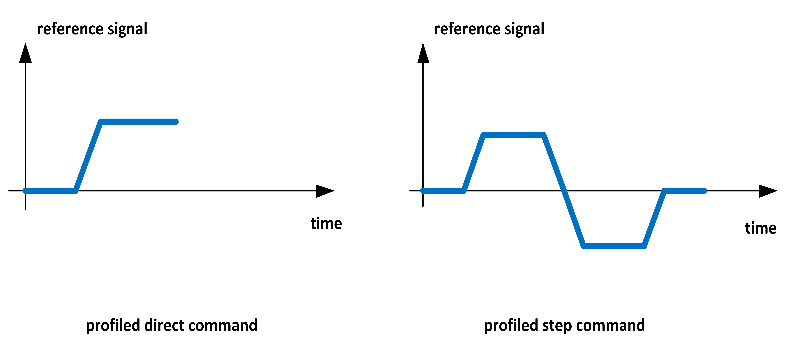

.. _app_demo_motion_control:

======================================================
Quick Start Guide for app_demo_motion_control
======================================================

.. contents:: In this document
    :backlinks: none
    :depth: 3

Introduction
===============
In many industrial applications, it is required to control torque, velocity or position of an electric motor. As an example, torque control is used in electric vehicle applications, velocity control is used in electric elevators, and position control is mostly used in robotic application.
In all of these applications, it is usually preferred to limit the acceleration rate of motor shaft to avoid mechanical stresses/damages. This aim can be achieved by using a profiled reference (with limited acceleration) instead of a sharp step command.

The purpose of **app_demo_motion_control** is to demonstrate how to control the torque, velocity or position of a motor with profiled reference values. 

In the prepared console interface, appropriate commands (and their functionality) are introduced to the user, and the user will be able to:
- select between different motion control modes (torque/velocity/position modes)
- send direct/step commands in each mode

By default, profiled references will be used. Figure 1 shows the difference between a profiled "direct command", and a profiled "step command".

**Fig. 1: Step and direct types of profiled reference values**

The data displayed over XScope will be:
      - Torque Command: The reference value of torque (milli-Nm)
      - Torque: The actual value of motor torque (milli-Nm)
      - Velocity Command: The reference value for velocity (rpm)
      - Velocity: The actual (measured) velocity (rpm)
      - Position Command: The reference value for position (ticks)
      - Position: The actual (measured) position value (ticks)

- Minimum Number of Cores: 5
- Minimum Number of Tiles: 3

.. cssclass:: github

  `See Application on Public Repository <https://github.com/synapticon/sc_sncn_motorcontrol/tree/master/examples/app_demo_motion_control/>`_

Quick How-to
============
**Important**

It is assumed that before starting this application, the PID parameters for velocity and position control are tuned and set in the software. To do this, please check :ref:`Set up your XMOS development tools <getting_started_xmos_dev_tools>`

1. :ref:`Assemble your SOMANET device <assembling_somanet_node>`.
2. Wire up your device. Check how at your specific :ref:`hardware documentation <hardware>`. Connect your position sensor, motor terminals, dc power supply, and XTAG. Power up!
**important**
For safety please use a current limited power supply and check current consumption.
3. :ref:`Set up your XMOS development tools <getting_started_xmos_dev_tools>`. 
4. Download and :ref:`import in your workspace <getting_started_importing_library>` the SOMANET Motor Control Library and its dependencies.
5. Open the **main.xc** within  the **app_demo_motion_control**. Include the :ref:`board-support file according to your device <somanet_board_support_module>`. Also set the :ref:`appropriate target in your Makefile <somanet_board_support_module>`.
**important**
Make sure the SOMANET Motor Control Library supports your SOMANET device. For that, check the :ref:`Hardware compatibility <motor_control_hw_compatibility>` section of the library.
6. :ref:`Set the configuration <motor_configuration_label>` for Motor Control, position sensor, and Motion Control Services. Moreover, set the initial parameters for your profile generators.
7. :ref:`Run the application enabling XScope <running_an_application>`.

.. seealso:: Did everything go well? If you need further support please check out our `forum <http://forum.synapticon.com/>`_.

.. cssclass:: github

  `See Application on Public Repository <https://github.com/synapticon/sc_sncn_motorcontrol/tree/master/examples/app_demo_motion_control/>`_