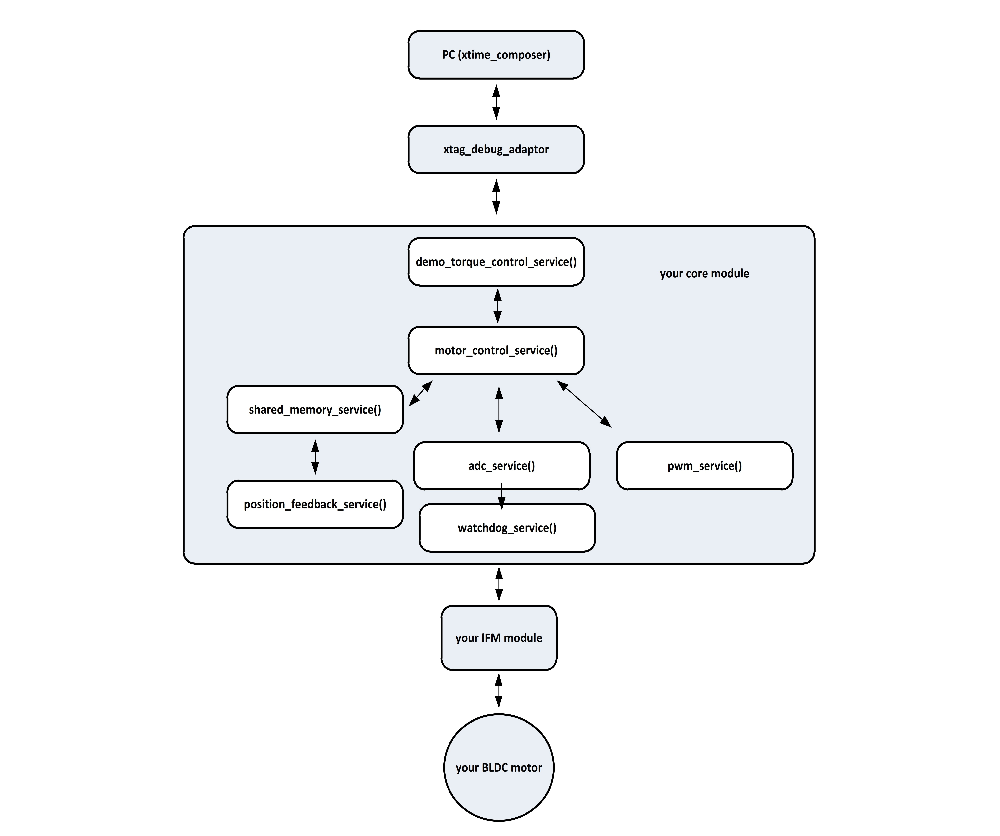

.. _app_demo_torque_control:

======================================================
Torque Control Demo
======================================================

.. contents:: In this document
    :backlinks: none
    :depth: 3

Electric motors are used in many motion control applications. In all of these applications, the final duty of the electric motor is to generate the required torque. In speed controlled applications the reference value of torque is calculated by speed controller. A similar situation is existing in the case of position controlled application. It is also possible to directly set the reference value of the torque by the user. The purpose of this application is to let the user directly work with torque controller.
By running this application, the user will be able to:

- switch between different operational modes (enabled/disabled torque controller, safe torque off mode)
- directly set the reference value of torque in [milli Nm]
- automatically find, read and set the commutation offset for position sensor
- observe different parameters of torque controller and position feedback on xscope
 
After starting the application, the torque controller will be activated automatically (with reference torque equal to 0), and the user can directly send the required torque command in [milli-Nm].

Figure 1 gives a general view of torque controller application including different blocks of your software and hardware modules.

**Fig. 1: General structure of your software/hardware modules within torque control application**

**important**

- before sending the reference torque it is recommended to find and set the commutation sensor offset
- if you are using an electric brake, release the brake before applying a new torque command
- it is recommended to start the application with lower voltages (such as 16V, and increase the voltage to its nominal value after your hardware is checked)

* **Minimum Number of Cores**: 7
* **Minimum Number of Tiles**: 2

.. cssclass:: github

  `See Application on Public Repository <https://github.com/synapticon/sc_sncn_motorcontrol/tree/master/examples/app_demo_offset_commutation_tuning/>`_

Console commands
================

The app uses commands to set the offsets and voltage over the console:

- a
    Automatically find the sensor offset and set the clockwise or counterclockwise commutation offsets. This is not very precise but should suffice to turn the motor. For Hall sensor, due to the low resolution, it can be needed to shift the offsets by +/- 682.
- c
    Automatically tune the sensor/commutation offsets (depending on the sensor used and the type of commutation). This works by searching the offset with minimum peak current consumption.
- d
    Reverse the motor direction. For FOC it is done by changing the winding type. For Sinusoidal commutation it is done by flipping the clockwise and counterclockwise commutation offsets.
- f
    For FOC only. Toggle the field controller.
- l VALUE
    Limit position to VALUE tick around the current position. The voltage will be set to ``0`` when the limit is reached and the motor will only be be able to move in the oposite direction. If VALUE is ``0`` this set the current position as the center position for the limiter. If VALUE is negative the position limiter is disabled.
- m
    Reverse motor polarity parameter, use this when the the motor is not moving. It happens when the phases wiring or the position sensor polarity is changed.
- o VALUE
    Set the commutation offset to VALUE (clockwise or counterclockwise offset depending on the voltage sign and winding type).
- p
    Print the offsets, sensor polarity and voltage.
- r
    Reverse the voltage
- s VALUE
    Set the sensor offset to VALUE.
- t VALUE
    Set the torque to VALUE, accept negative values. Currently only available for FOC.
- z
    Return to the zero position (can be set with the ``l`` command). This will work only if the direction of the motor is right. That means positive voltage corresponds to positive velocity.
- VALUE
    Set the voltage to VALUE, accept negative values.

Quick How-to
============

#. :ref:`Assemble your SOMANET device <assembling_somanet_node>`.
#. Wire up your device. Check how at your specific :ref:`hardware documentation <hardware>`. Connect your position sensor, motor phases, power supply cable, and XTAG. Power up!

   .. important:: For safety please use a current limited power supply and always monitor the current consumption during the tuning procedure.

#. :ref:`Set up your XMOS development tools <getting_started_xmos_dev_tools>`.
#. Download and :ref:`import in your workspace <getting_started_importing_library>` the SOMANET Motor Control Library and its dependencies.
#. Edit **user_config.h** in **config_motor** to set the motor parameters. The importants parameters are the number of poles pairs, the winding type, the commutation sensor and the commutation offsets. For the first start leave the offsets to their default values.

   .. code-block:: C

                #define POLE_PAIRS                11
                #define BLDC_WINDING_TYPE         STAR_WINDING
                #define MOTOR_COMMUTATION_SENSOR  AMS_SENSOR
                #define COMMUTATION_OFFSET_CLK    0
                #define COMMUTATION_OFFSET_CCLK   2048

#. Set parameters for your position sensor. The most important parameters are the sensor offset and polarity. For the first start leave the default offset value. The sensor polarity will define the physical direction of your motor. You can use the test app of the position sensor to test which physical direction corresponds to a positive velocity.

   - For AMS sensor edit **ams_service.h** in **module_ams_rotary_sensor**:

     .. code-block:: C

                     #define AMS_OFFSET      0
                     #define AMS_POLARITY    AMS_POLARITY_NORMAL

   - For BiSS sensor edit **biss_service.h** in **module_biss**:

     .. code-block:: C

                     #define BISS_OFFSET_ELECTRICAL  0
                     #define BISS_POLARITY           BISS_POLARITY_NORMAL

   - For Hall sensor no parameters are needed.

#. Open the **main.xc** within  the **app_demo_offset_commutation_tuning**. Include the :ref:`board-support file according to your device <somanet_board_support_module>`. Also set the :ref:`appropiate target in your Makefile <somanet_board_support_module>`.

   .. important:: Make sure the SOMANET Motor Control Library supports your SOMANET device. For that, check the :ref:`Hardware compatibility <motor_control_hw_compatibility>` section of the library.

#. Set parameters for your :ref:`Motor Control Service <module_motorcontrol>` to use the values previously defined in **user_config.h**. The motor polarity depends on the wiring of the phases and the position sensor polarity.

   .. code-block:: C

                /* Motor Control Service */
                {
                    MotorcontrolConfig motorcontrol_config;
                    motorcontrol_config.motor_type = BLDC_MOTOR;
                    motorcontrol_config.polarity_type = NORMAL_POLARITY;
                    motorcontrol_config.commutation_sensor = MOTOR_COMMUTATION_SENSOR;
                    motorcontrol_config.bldc_winding_type = BLDC_WINDING_TYPE;
                    motorcontrol_config.hall_offset[0] = COMMUTATION_OFFSET_CLK;
                    motorcontrol_config.hall_offset[1] = COMMUTATION_OFFSET_CCLK;
                    motorcontrol_config.commutation_loop_period = COMMUTATION_LOOP_PERIOD;

                    motorcontrol_service(fet_driver_ports, motorcontrol_config,
                                            c_pwm_ctrl, i_hall[0], null, i_biss[0], i_ams[0], i_watchdog[0], i_motorcontrol);
                }

#. Define a low voltage value to start with. The value depends on you motor, usually less than 1000. The value can be changed at run time in the app. Remember to use a current limited power supply and always monitor the current consumption.

   .. code-block:: C

                   #define VOLTAGE 1000

#. :ref:`Run the application enabling XScope <running_an_application>`.

#. The app start with ``0`` commutation voltage so the motor will not move and the current consumption should be low. Remember to use a current limited power supply and always monitor the current consumption.

   First try to set the offset automatically with the ``a`` command. If the motor is not turning and the current consumption is high try to change the motor polarity with the ``d`` command and repeat the ``a`` command. This will find the sensor offset and set the clockwise or counterclockwise commutation offsets to 0 and 2048 (half a turn) and the motor should start turning.

   With a positive voltage the motor should turn in the direction of positive velocity. If it is not the case you can change the direction by flipping the clockwise and counterclockwise commutation offsets with the ``f`` command.

   Fine tune the sensor commutation offset for the current direction. You could use the ``c`` command for auto tuning or the ``VALUE`` command to manually minimize the phases current. The offset is a 12 bit positive value so it wraps around at 4096. It means that if you want an offset of ``-100`` you enter ``3996``.

   Reverse the voltage with the ``r`` command, the motor should turn in the other direction. Fine tune the commutation offset for this direction with the ``c`` (auto tuning) or ``VALUE`` (manual tuning) command.

   You can change the voltage with the ``v VALUE`` command (up to 4000) to test and tune the offsets at a different velocity and obtain finer results.

   You can print all the current offsets with the ``p`` command.

   .. important:: When you have found all the offsets save them in your configuration files for your app:

                  - the motor configuration file **user_config.h**
                  - the sensor configuration file **ams_service.h** or **biss_service.h**
                  - the **main.c** of your app (for the motor polarity)

.. seealso:: Did everything go well? If you need further support please check out our `forum <http://forum.synapticon.com/>`_.
