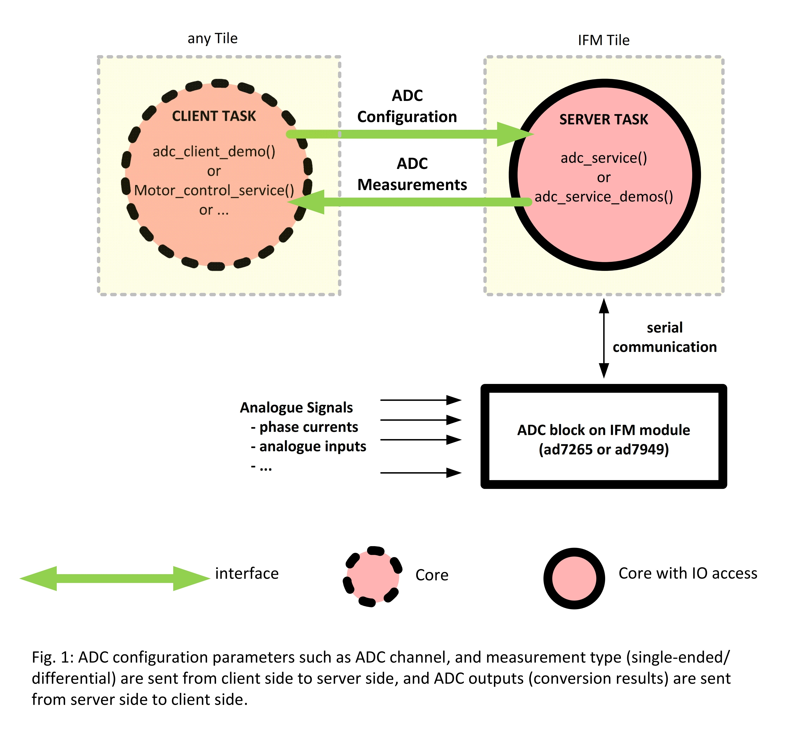

==================
ADC Module 
==================

.. contents:: In this document
    :backlinks: none
    :depth: 3

This module provides a Service that will read and process the data coming from the ADC 
on your SOMANET device. Up to 2 clients could retrieve data from the Service
through interfaces.

The ADC Service should always run over an **IFM Tile** so it can access the ports of your SOMANET IFM device.

.. cssclass:: github

  `See Module on Public Repository <https://github.com/synapticon/sc_sncn_motorcontrol/tree/master/module_adc>`_

How to use
==========

.. important:: We assume that you are using :ref:`SOMANET Base <somanet_base>` and your app includes the required **board support** files for your SOMANET device.
          
1. First, add all the **SOMANET Motor Control Library** modules to your app Makefile.

    ::

		USED_MODULES = config_motor module_adc module_advanced_torquecontrol_lib module_biss module_board-support module_controllers_lib module_ctrl_loops module_filters_lib module_foc module_hall module_shared_memory module_misc module_position_feedback module_pwm module_qei module_rem_14 module_rem_16mt module_serial_encoder module_spi_master module_watchdog

    .. note:: Not all modules will be required, but when using a library it is recommended to include always all the contained modules. 
          This will help solving internal dependency issues.

2. Include the ADC Service header **adc_service.h**, **adc_7265.h** and **adc_ad7949.h** in your app. 

    .. note:: In case of using **adc_service** service of module_adc only add **adc_service.h** header to your app.

3. Define the required adc ports in the board-support-package of your IFM module. By default, these ports are defined as SOMANET_IFM_ADC_PORTS in board-support-package of your SOMANET device.

4. Inside your main function, instantiate the interfaces array for the Service-Clients communication (in this case, adc server and adc client).

5. At your IFM tile, instantiate the Service. 

6. At whichever other core, now you can perform calls to the ADC Service through the interfaces connected to it.

.. code-block:: c

        #include <CORE_C22-rev-a.bsp>   //Board Support file for SOMANET Core C22 device 
        #include <IFM_DC1K-rev-c3.bsp>  //Board Support file for SOMANET IFM DC1K device 
                                        //(select your board support files according to your device)

        #include <adc_service.h> // 2

        ADCPorts adc_ports = SOMANET_IFM_ADC_PORTS; // 3

        int main(void)
        {
            interface ADCInterface i_adc[2] // 4

            par
            {
                on tile[APP_TILE]: 
                {
                        int a, b;       
                        {a, b} = i_adc.get_channel(CHANNEL_ID);// 6  
            			                                       // CHANNEL_IDs are defined in the adc_service.h file, and can be used depending on adc type of your module.
                }

                on tile[IFM_TILE]: // 5
                {
                    if(!isnull(adc_ports.ad7949_ports.clk))         adc_ad7949_service_demo(adc_ports.ad7949_ports, i_adc);
                    else if(!isnull(adc_ports.ad7265_ports.xclk))   adc_ad7265_service_demo(adc_ports.ad7265_ports, i_adc);
                }
            }

            return 0;
        }

API
===

Types
-----

.. doxygenstruct:: AD7949Ports
.. doxygenstruct:: AD7265Ports
.. doxygenstruct:: ADCPorts

Service
-------

.. doxygenfunction:: adc_service

Interface
---------

.. doxygeninterface:: ADCInterface
