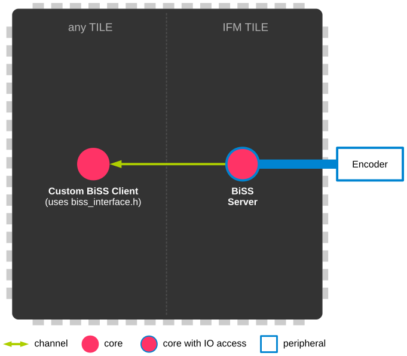

========================================
SOMANET BiSS Encoder Interface Component
========================================

Overview
========
.. contents:: In this document
    :backlinks: none
    :depth: 3

**BiSS** BiSS is an open source digital interface for sensors and actuators. BiSS is hardware compatible to the industrial standard SSI (Serial Synchronous Interface). The standardization process is coordinated on biss-interface.com_.
 
This module (**module_biss**) provides a BiSS server thread which read BiSS sensor data from the encoder and extract position information when called by the client with an interface; and provides an interface for the client to get position from the BiSS server.

All communication is done by interface communication and client interface calls following a Server-Client scheme.

.. _biss-interface.com: http://www.biss-interface.com/

   Core diagram
   
BiSS Encoder Interface API
================================

Service
----------------

.. doxygenfunction:: biss_service

Interface
---------

.. doxygeninterface:: BISSInterface

Types
-----

.. doxygenstruct:: BISSConfig

.. _biss_programming_label:

How to Use
==========

Getting position information from your BiSS Encoder
---------------------------------------------------

Step 1: Include the required modules & headers
^^^^^^^^^^^^^^^^^^^^^^^^^^^^^^^^^^^^^^^^^^^^^^
Make sure you Makefile contains at least these modules

::

    USED_MODULES = module_biss module_board-support

Make sure you include these files in your main.xc file

::

    #include <xscope.h>
    #include <timer.h>
    #include <biss_server.h>
    #include <biss_client.h>

Step 2: Define required interfaces
^^^^^^^^^^^^^^^^^^^^^^^^^^^^^^^^^^
An interface is required to transport data from the biss_server task to your custom client's task

::

	int main(void)
	{
		interface i_biss i_biss[2];
		...
	}

Step 4: Run BiSS Encoder Interface Server
^^^^^^^^^^^^^^^^^^^^^^^^^^^^^^^^^^^^^^^^^

.. important:: Please note that all the server must be executed on a tile with access to I/O of a Synapticon SOMANET IFM Drive DC board. 

::

    int main(void)
    {
    ...

        par
        {
        ...

            on tile[IFM_TILE]:
            {
                par
                {
                    /* BiSS Server */
                    {
                        biss_par biss_params;
			run_biss(i_biss, qei_q_ch1, p_ifm_encoder_ch2, clk_biss, 10, 1, biss_params, 2);
                    }
                }
            }
            ...

        }

        return 0;
    }

Getting position information from biss server
---------------------------------------------
While the BiSS server is running, the position can be aquired by a simple API call:

::

    int main(void)
    {
    ...

        par
        {
            on tile[0]: // Can be any tile
            {
                /* get position from BiSS Encoder */
        	{ count, position, status } = i_biss[0].get_position();
            }
        }
    ...

    }
