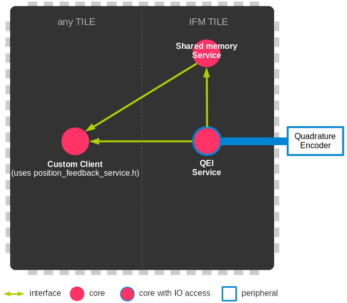

.. _module_incremental_encoder:

===========================
Incremental Encoder Module
===========================

.. contents:: In this document
    :backlinks: none
    :depth: 3

This module provides a Service that will read and process the data coming from your 
Incremental Encoder Feedback Sensor.

This service can run independently but is meant to be used by the :ref:`Position Feedback Module <module_position_feedback>` that is why it uses the same communication interface.

The Service should always run over an **IF2 tile** so it can access the ports to
your SOMANET Drive module.

.. cssclass:: github

  `See Module on Public Repository <https://github.com/synapticon/sc_sncn_motorcontrol/tree/master/module_incremental_encoder>`_

How to use
==========

.. important:: We assume that you are using :ref:`SOMANET Base <somanet_base>` and your app includes the required **board support** files for your SOMANET device.
          
.. seealso:: You might find useful the :ref:`QEI Encoder Interface Test <app_test_qei>` example app, which illustrates the use of this module. 

1. First, add all the :ref:`SOMANET Motor Control <somanet_motor_control>` modules to your app Makefile.

    ::

        USED_MODULES = configuration_parameters module_biss_encoder lib_bldc_torque_control module_board-support module_hall_sensor module_shared_memory module_utils module_position_feedback module_incremental_encoder module_encoder_rem_14 module_encoder_rem_16mt module_serial_encoder module_spi_master

    .. note:: Not all modules will be required, but when using a library it is recommended to include always all the contained modules. 
          This will help solving internal dependency issues.

2. Include the Encoder Service header **qei_service.h** in your app. 

3. Instantiate the ports where the Service will be reading the Encoder Sensor feedback signals. 

     The QEI service uses ``qei_hall_port`` ``1`` or ``2`` depending on the configuration.
     The ports structures are defined in ``position_feedback_service.h``.
     On some boards the ``p_hall_enc_select`` is also used to select the input port configuration between RS422 (differential) and TTL.

4. Inside your main function, instantiate the interfaces array for the Service-Clients communication.

5. Optionally, instantiate the shared memory interface.

6. At your IF2 tile, instantiate the Service. For that, first you will have to fill up your Service configuration.

     The QEI sensor has some specific parameters. ``index_type`` to select if the encoder has a index pulse.
     ``signal_type`` to select the input port configuration between RS422 (differential) and TTL.
     ``port_number`` to select the input port number.
     You still need to fill up all the generic sensor parameters especially ``tile_usec``, ``resolution``, ``velocity_compute_period`` and ``sensor_function``.

7. At whichever other core, now you can perform calls to the Encoder Service through the interfaces connected to it.

    .. code-block:: c

        #include <CoreC2X.bsp>   			//Board Support file for SOMANET Core C2X device 
        #include <Drive1000-rev-c4.bsp>     //Board Support file for SOMANET Drive module 
                                            //(select your board support files according to your device)
                                        
        // 2. Include the Hall Service header
        #include <qei_service.h>
       
        // 3. Instantiate the ports needed for the sensor.
        HallEncSelectPort hall_enc_select_port = SOMANET_DRIVE_ENCODER_PORTS_INPUT_MODE_SELECTION;
		port ? qei_hall_port_1 = SOMANET_DRIVE_ENCODER_1_PORT;
		port ? qei_hall_port_2 = SOMANET_DRIVE_ENCODER_2_PORT;

        int main(void)
        {
            // 4. Instantiate the interfaces array for the Service-Clients communication.
            interface PositionFeedbackInterface i_position_feedback_1[3];
            
            // 5. Instantiate the shared memory interface.
            interface shared_memory_interface i_shared_memory[3];

            par
            {

                on tile[IF2_TILE]: par {
                    // 5. Start the shared memory service
                    shared_memory_service(i_shared_memory, 3);

                    // 6. Fill up your Service configuration and instantiate the Service. 
                    /* Position feedback service */
                    {
                        //set default parameters
                        PositionFeedbackConfig position_feedback_config;
                        position_feedback_config.sensor_type = QEI_SENSOR;
                        position_feedback_config.polarity    = NORMAL_POLARITY;
                        position_feedback_config.resolution  = QEI_SENSOR_RESOLUTION;
                        position_feedback_config.tile_usec   = IF2_TILE_USEC;
                        position_feedback_config.max_ticks   = SENSOR_MAX_TICKS;
                        position_feedback_config.velocity_compute_period = QEI_SENSOR_VELOCITY_COMPUTE_PERIOD;
                        position_feedback_config.sensor_function = SENSOR_FUNCTION_COMMUTATION_AND_MOTION_CONTROL;

                        position_feedback_config.qei_config.index_type  = QEI_SENSOR_INDEX_TYPE;
                        position_feedback_config.qei_config.signal_type = QEI_SENSOR_SIGNAL_TYPE;
                        position_feedback_config.qei_config.port_number = QEI_SENSOR_PORT_NUMBER;
						position_feedback_config.qei_config.ticks_lost_threshold = QEI_SENSOR_TICKS_LOST;
						
                        position_feedback_service(qei_hall_port_1, qei_hall_port_2, null, null, null, null, null, null,
                                position_feedback_config, i_shared_memory[0], i_position_feedback_1,
                                null, null, null);
                    }
                }
                
                on tile[APP_TILE]:
                {
                    int count_1, position_1, angle_1, velocity_1;
                    int count_2, position_2, status_2, angle_2, velocity_2;
                    
                    // 7. Call to the Position Feddback Service through the interfaces connected to it.                
                    /* get position from Sensor 1 */
                    { count_1, position_1, void } = i_position_feedback_1[0].get_position();
                    angle_1 = i_position_feedback_1[0].get_angle();
                    velocity_1 = i_position_feedback_1[0].get_velocity();
                    
                    // 7. You can also read the position using the shared memory.
                    UpstreamControlData upstream_control_data = i_shared_memory[2].read();
                    angle_1 = upstream_control_data.angle;
                    count_1 = upstream_control_data.position;
                    velocity_1 = upstream_control_data.velocity;
                }
            }

            return 0;
        }

API
===

Types
-----
.. doxygenenum:: QEI_SignalType
.. doxygenenum:: QEI_IndexType
.. doxygenstruct:: QEIConfig
.. doxygenstruct:: PositionFeedbackConfig
.. doxygenstruct:: QEIHallPort
.. doxygenstruct:: HallEncSelectPort

Service
--------

.. doxygenfunction:: qei_service

