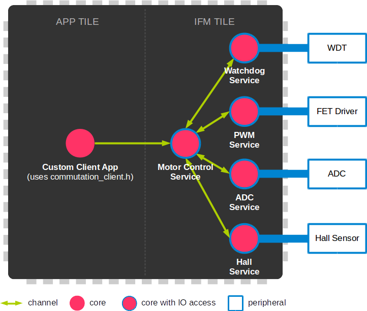

.. _module_motorcontrol:

==================================
Motor Control Module
==================================

.. contents:: In this document
    :backlinks: none
    :depth: 3

This module provides a Service that will let you spin at a desired voltage Brushed DC and BLDC motors
by applying sinusodial commutation. Up to 5 clients can control and communicate with the Service over interfaces.

The Service will require other services to run in parallel, such as PWM, Hall Feedback and Watchdog Service.

When running the Motorcontrol Service, the **Reference Frequency** of the tile where the Service is
allocated will be automatically changed to **250MHz**.

The Motorcontrol Service should always run over an **IFM tile** so it can access the ports to
your SOMANET IFM device.

.. cssclass:: github

  `See Module on Public Repository <https://github.com/synapticon/sc_sncn_motorcontrol/tree/master/module_motorcontrol>`_

   Diagrams shows core/task diagram of a client app using motorcontrol_service

.. _commutation_programming_label:

How to use
===========

.. important:: We assume that you are using :ref:`SOMANET Base <somanet_base>` and your app includes the required **board support** files for your SOMANET device.
          
.. seealso:: You might find useful the :ref:`BLDC DC Motor Control Demo <bldc_motor_drive_demo>` and :ref:`Brushed DC Motor Control Demo <brushed_dc_drive_demo>` example apps, which illustrate the use of this module. 

1. First, add all the :ref:`SOMANET Motor Control <somanet_motor_control>` modules to your app Makefile.

    ::

        USED_MODULES = module_motorcontrol module_pwm_symmetrical module_adc module_ctrl_loops module_hall module_misc module_profile module_qei module_watchdog module_board-support

    .. note:: Not all modules will be required, but when using a library it is recommended to include always all the contained modules. 
          This will help solving internal dependency issues.

2. Properly instantiate **PWM**, **Hall** and **Watchdog** Services.

3. Include the Motor Control Service header **motorcontrol_service.h** in your app. 

4. Instantiate the ports where the Service will be accessing the FET Driver signals. 

5. Inside your main function, instantiate the interfaces array for the Service-Clients communication.

6. At your IFM tile, instantiate the Service. For that, first you will have to fill up your Service configuration and provide the PWM, Hall and Watchdog interfaces or channels.

7. At whichever other core, now you can perform calls to the Motor-control Service through the interfaces connected to it.

    .. code-block:: c

        #include <CORE_C22-rev-a.bsp>   //Board Support file for SOMANET Core C22 device 
        #include <IFM_DC100-rev-b.bsp>  //Board Support file for SOMANET IFM DC100 device 
                                        //(select your board support files according to your device)

        #include <pwm_service.h>
        #include <hall_service.h>
        #include <watchdog_service.h>
        #include <motorcontrol_service.h> // 3

        PwmPorts pwm_ports = SOMANET_IFM_PWM_PORTS;
        WatchdogPorts wd_ports = SOMANET_IFM_WATCHDOG_PORTS;
        HallPorts hall_ports = SOMANET_IFM_HALL_PORTS;
        FetDriverPorts fet_driver_ports = SOMANET_IFM_FET_DRIVER_PORTS; // 4

        int main(void) {

            chan c_pwm_ctrl; 
            interface WatchdogInterface i_watchdog[2];
            interface HallInterface i_hall[5];
            interface MotorcontrolInterface i_motorcontrol[5]; // 5

            par
            {

                on tile[APP_TILE]: i_motorcontrol[0].set_voltage(100); // 7

                on tile[IFM_TILE]:
                {
                    par
                    {
                        pwm_service( pwm_ports, c_pwm_ctrl);

                        watchdog_service(wd_ports, i_watchdog);

                        {
                            HallConfig hall_config;
                            hall_config.pole_pairs = 1;

                            hall_service(hall_ports, hall_config, i_hall);
                        }

                        {
                            MotorcontrolConfig motorcontrol_config; 
                            motorcontrol_config.motor_type = BLDC_MOTOR;
                            motorcontrol_config.commutation_sensor = HALL_SENSOR;
                            motorcontrol_config.bldc_winding_type = STAR_WINDING;
                            motorcontrol_config.hall_offset[0] =  0;
                            motorcontrol_config.hall_offset[1] = 0;
                            motorcontrol_config.commutation_loop_period = 60;

                            motorcontrol_service(fet_driver_ports, motorcontrol_config,
                                            c_pwm_ctrl, i_hall[0], null, i_watchdog[0], i_motorcontrol); // 6
                        }
                    }
                }
            }

            return 0;
        }

API
====

Types
-----
.. doxygenstruct:: FetDriverPorts
.. doxygenenum:: MotorType
.. doxygenenum:: BLDCWindingType
.. doxygenstruct:: MotorcontrolConfig

Service
--------

.. doxygenfunction:: motorcontrol_service

Interface
---------

.. doxygeninterface:: MotorcontrolInterface

