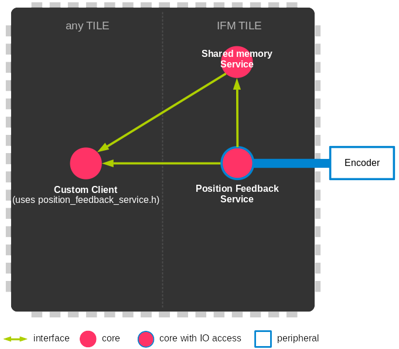

.. _module_position_feedback:

========================
Position Feedback Module
========================

.. contents:: In this document
    :backlinks: none
    :depth: 3

This module provides a Service which starts one or two Position Sensor Services among BiSS, REM 16MT, REM 14, Hall and QEI. The service can also manage the GPIO ports.

The service takes as parameters:
 - ports for the different sensors
 - one config structure for each of the sensor services started (so 2 structures).
 - client interfaces to the shared memory for each of the sensor services (2).
 - server interfaces for the sensor services (2).

The service will initialize the ports and detect wrong configurations (for exemple starting two sensor services using the same ports). Then it will start one or two services. The second service is optional and will not be started if no config structure or server interface is provided it. The types of the sensor services started are set using the ``sensor_type`` parameter of the config structure.

The service provides an interface which can be used to get or set the configuration or the position data. This interface should only be used for configuration and debug purposes. For periodic data reading the shared memory should be used.

The shared memory is useful for other services to retrieve position and velocity data without blocking. There are 5 modes to configure which data is sent to the shared memory:
  - send nothing
  - send the electrical angle for commutation and the absolute position/velocity for motion control
  - send the electrical angle for commutation and the absolute position/velocity for secondary feedback (for display only)
  - send only the absolute position/velocity for motion control
  - send only the absolute position/velocity for secondary feedback (for display only)

The mode is set using the ``sensor_function`` parameter of the config structure.

It is possible to switch the sensor service type at runtime. You need fist to update the config structure to set the ``sensor_type`` that you want. Then you call the ``exit()`` interface which will restart the Position Feedback Service with the new sensor service.

This Service should always run over an **IF2 Tile** so it can access the ports to
your SOMANET Drive module.

.. cssclass:: github

  `See Module on Public Repository <https://github.com/synapticon/sc_sncn_motorcontrol/tree/master/module_position_feedback>`_

How to use
==========

.. important:: We assume that you are using :ref:`SOMANET Base <somanet_base>` and your app includes the required **board support** files for your SOMANET device.

.. seealso:: You might find useful the :ref:`Position feedback Demo <app_test_position_feedback>`, which illustrates the use of this module.

1. First, add all the :ref:`SOMANET Motor Control <somanet_motor_control>` modules to your app Makefile. The Position Feedback Service needs all the sensor modules it supports (BiSS, REM 16MT, REM 14, Hall and QEI).

    ::

        USED_MODULES = configuration_parameters module_biss_encoder lib_bldc_torque_control module_board-support module_hall_sensor module_shared_memory module_utils module_position_feedback module_incremental_encoder module_encoder_rem_14 module_encoder_rem_16mt module_serial_encoder module_spi_master

    .. note:: Not all modules will be required, but when using a library it is recommended to include always all the contained modules.
          This will help solving internal dependency issues.

2. Include the Position Feedback Service header **position_feedback_service.h** in your app.

3. Instantiate the ports needed for the sensors.

4. Inside your main function, instantiate the interfaces array for the Service-Clients communication.

5. Optionally, instantiate the shared memory interface.

6. At your IF2 tile, instantiate the Service. For that, first you will have to fill up your Service configuration.

    The service configuration contains generic sensor parameters and also structures for sensor specific parameters.
    You need to fill up all the parameters for the sensor you want to use.
    You also need to fill up all the generic parameters especially ``tile_usec``, ``resolution``, ``velocity_compute_period`` and ``sensor_function``.
    As the service supports two sensors there is two configurations structures. The sensor type is selected with the ``sensor_type`` parameter.

7. At whichever other core, now you can perform calls to the Position Feedback Service through the interfaces connected to it. Or if it is enabled you can read the position using the shared memory.

    .. code-block:: c

        #include <CoreC2X.bsp>   			//Board Support file for SOMANET Core C2X device 
        #include <Drive1000-rev-c4.bsp>     //Board Support file for SOMANET Drive module 
                                            //(select your board support files according to your device)
                                        
        // 2. Include the Position Feedback Service header
        #include <position_feedback_service.h>
       
        // 3. Instantiate the ports needed for the sensors.
        HallEncSelectPort hall_enc_select_port = SOMANET_DRIVE_ENCODER_PORTS_INPUT_MODE_SELECTION;
		port ? qei_hall_port_1 = SOMANET_DRIVE_ENCODER_1_PORT;
		port ? qei_hall_port_2 = SOMANET_DRIVE_ENCODER_2_PORT;
		port ?gpio_port_0 = SOMANET_DRIVE_GPIO_D0;
		port ?gpio_port_1 = SOMANET_DRIVE_GPIO_D1;
		port ?gpio_port_2 = SOMANET_DRIVE_GPIO_D2;
		port ?gpio_port_3 = SOMANET_DRIVE_GPIO_D3;   

        int main(void)
        {
            // 4. Instantiate the interfaces array for the Service-Clients communication.
            interface PositionFeedbackInterface i_position_feedback_1[3];
            interface PositionFeedbackInterface i_position_feedback_2[3];
            
            // 5. Instantiate the shared memory interface.
            interface shared_memory_interface i_shared_memory[3];

            par
            {

                on tile[IF2_TILE]: par {
                    // 5. Start the shared memory service
                    shared_memory_service(i_shared_memory, 3);

                    // 6. Fill up your Service configuration and instantiate the Service. 
                    /* Position feedback service */
                    {
                        PositionFeedbackConfig position_feedback_config;
                    position_feedback_config.sensor_type = SENSOR_1_TYPE;
                    position_feedback_config.resolution  = SENSOR_1_RESOLUTION;
                    position_feedback_config.polarity    = SENSOR_1_POLARITY;
                    position_feedback_config.velocity_compute_period = SENSOR_1_VELOCITY_COMPUTE_PERIOD;
                    position_feedback_config.pole_pairs  = MOTOR_POLE_PAIRS;
                    position_feedback_config.tile_usec   = IF2_TILE_USEC;
                    position_feedback_config.max_ticks   = SENSOR_MAX_TICKS;
                    position_feedback_config.offset      = HOME_OFFSET;
                    position_feedback_config.sensor_function = SENSOR_1_FUNCTION;

                    position_feedback_config.biss_config.multiturn_resolution = BISS_MULTITURN_RESOLUTION;
                    position_feedback_config.biss_config.filling_bits = BISS_FILLING_BITS;
                    position_feedback_config.biss_config.crc_poly = BISS_CRC_POLY;
                    position_feedback_config.biss_config.clock_frequency = BISS_CLOCK_FREQUENCY;
                    position_feedback_config.biss_config.timeout = BISS_TIMEOUT;
                    position_feedback_config.biss_config.busy = BISS_BUSY;
                    position_feedback_config.biss_config.clock_port_config = BISS_CLOCK_PORT;
                    position_feedback_config.biss_config.data_port_number = BISS_DATA_PORT_NUMBER;
                    position_feedback_config.biss_config.data_port_signal_type = BISS_DATA_PORT_SIGNAL_TYPE;

                    position_feedback_config.rem_16mt_config.filter = REM_16MT_FILTER;

                    position_feedback_config.rem_14_config.hysteresis              = REM_14_SENSOR_HYSTERESIS;
                    position_feedback_config.rem_14_config.noise_settings          = REM_14_SENSOR_NOISE_SETTINGS;
                    position_feedback_config.rem_14_config.dyn_angle_error_comp    = REM_14_DYN_ANGLE_ERROR_COMPENSATION;
                    position_feedback_config.rem_14_config.abi_resolution_settings = REM_14_ABI_RESOLUTION_SETTINGS;

                    position_feedback_config.qei_config.number_of_channels = QEI_SENSOR_NUMBER_OF_CHANNELS;
                    position_feedback_config.qei_config.signal_type        = QEI_SENSOR_SIGNAL_TYPE;
                    position_feedback_config.qei_config.port_number        = QEI_SENSOR_PORT_NUMBER;
                    position_feedback_config.qei_config.ticks_lost_threshold = QEI_SENSOR_TICKS_LOST;

                    position_feedback_config.hall_config.port_number = HALL_SENSOR_PORT_NUMBER;
                    position_feedback_config.hall_config.hall_state_angle[0]=HALL_STATE_1_ANGLE;
                    position_feedback_config.hall_config.hall_state_angle[1]=HALL_STATE_2_ANGLE;
                    position_feedback_config.hall_config.hall_state_angle[2]=HALL_STATE_3_ANGLE;
                    position_feedback_config.hall_config.hall_state_angle[3]=HALL_STATE_4_ANGLE;
                    position_feedback_config.hall_config.hall_state_angle[4]=HALL_STATE_5_ANGLE;
                    position_feedback_config.hall_config.hall_state_angle[5]=HALL_STATE_6_ANGLE;

                    position_feedback_config.gpio_config[0] = GPIO_CONFIG_1;
                    position_feedback_config.gpio_config[1] = GPIO_CONFIG_2;
                    position_feedback_config.gpio_config[2] = GPIO_CONFIG_3;
                    position_feedback_config.gpio_config[3] = GPIO_CONFIG_4;

                    //setting second sensor
                    PositionFeedbackConfig position_feedback_config_2 = position_feedback_config;
                    position_feedback_config_2.sensor_type = 0;
                    if (SENSOR_2_FUNCTION != SENSOR_FUNCTION_DISABLED) //enable second sensor
                    {
                        position_feedback_config_2.sensor_type = SENSOR_2_TYPE;
                        position_feedback_config_2.polarity    = SENSOR_2_POLARITY;
                        position_feedback_config_2.resolution  = SENSOR_2_RESOLUTION;
                        position_feedback_config_2.velocity_compute_period = SENSOR_2_VELOCITY_COMPUTE_PERIOD;
                        position_feedback_config_2.sensor_function = SENSOR_2_FUNCTION;
                    }

                    position_feedback_service(qei_hall_port_1, qei_hall_port_2, hall_enc_select_port, spi_ports, gpio_port_0, gpio_port_1, gpio_port_2, gpio_port_3,
                            position_feedback_config, i_shared_memory[0], i_position_feedback_1,
                            position_feedback_config_2, i_shared_memory[1], i_position_feedback_2);
                    }
                }
                
                on tile[APP_TILE]:
                {
                    int count_1, position_1, status_1, angle_1, velocity_1;
                    int count_2, position_2, status_2, angle_2, velocity_2;
                    
                    // 7. Call to the Position Feddback Service through the interfaces connected to it.                
                    /* get position from Sensor 1 */
                    { count_1, position_1, status_1 } = i_position_feedback_1[0].get_position();
                    angle_1 = i_position_feedback_1[0].get_angle();
                    velocity_1 = i_position_feedback_1[0].get_velocity();
                    
                    /* get position from Sensor 2 */
                    { count_2, position_2, status_2 } = i_position_feedback_2[0].get_position();
                    angle_2 = i_position_feedback_2[0].get_angle();
                    velocity_2 = i_position_feedback_2[0].get_velocity();
                    
                    // 7. You can also read the position using the shared memory.
                    UpstreamControlData upstream_control_data = i_shared_memory[2].read();
                    angle_1 = upstream_control_data.angle;
                    count_1 = upstream_control_data.position;
                    velocity_1 = upstream_control_data.velocity;
                }
            }

            return 0;
        }

API
===

Types
-----

.. doxygenenum:: GPIOType
.. doxygenenum:: SensorFunction
.. doxygenenum:: SensorError
.. doxygenenum:: EncoderPortNumber
.. doxygenenum:: PositionFeedbackPortsLocation
.. doxygenstruct:: PositionFeedbackPortsCheck
.. doxygenstruct:: PositionFeedbackConfig

.. doxygenstruct:: SPIPorts
.. doxygenstruct:: HallEncSelectPort

Service
--------

.. doxygenfunction:: position_feedback_service

Interface
---------

.. doxygeninterface:: PositionFeedbackInterface

Functions
---------

.. doxygenfunction:: tickstobits
.. doxygenfunction:: multiturn
.. doxygenfunction:: write_shared_memory
.. doxygenfunction:: velocity_compute
.. doxygenfunction:: gpio_read
.. doxygenfunction:: gpio_write
.. doxygenfunction:: gpio_shared_memory
