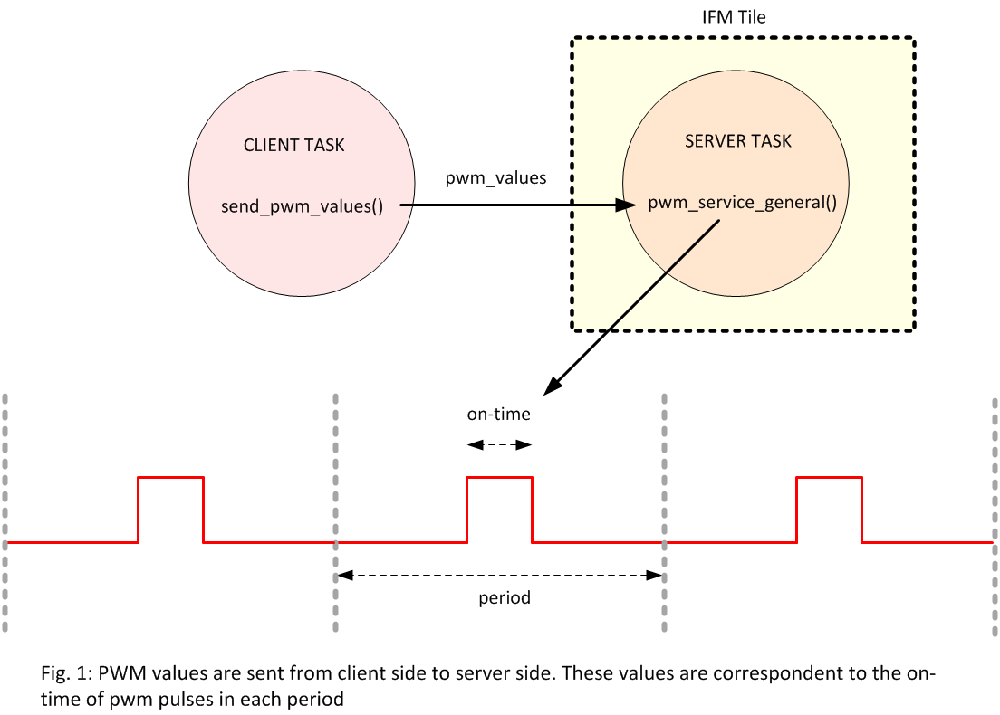

.. _module_pwm:

==========
PWM Module
==========

.. contents:: In this document
    :backlinks: none
    :depth: 3

This module provides a Service (pwm_service_general) to generate center-aligned Pulse-Width modulation(PWM) signals for both high-side and low-side FETs of your drive module. PWM module can be used to cycle on-and-off a digital signal in order to control a load which requires electrical power. This module is designed to control 8 inverter outputs at the same time. Among these 8 outputs 6 outputs can be used to drive 2 three-phase electric motors (connected to 6 inverter outputs) and the remaining 2 can be used to for other applications (such as activation/deactivation of electric brakes. etc.). 
PWM frequency can be 15 kHz, 30 kHz or even 100 kHz. Among them, 15 kHz of switching frequency is recommended for normal applications as it results in higher voltage efficiency).
As shown in figure 1, only the on-time of PWM pulses can be changed. The on-time (for each inverter output can be adjusted by sending the corresponding pwm_value to pwm_service_general through an interface. By this technique, it is possible to modulate a given reference voltage.

The PWM Service should always run over an **IF2 Tile** so it can access the ports of your SOMANET Drive.

If PWM signals are used to drive an inverter, the watchdog service should also be running to activate the Drive ports.

.. cssclass:: github

  `See Module on Public Repository <https://github.com/synapticon/sc_sncn_motorcontrol/tree/master/module_pwm>`_

How to use
==========

.. important:: It is assumed that you are using :ref:`SOMANET Base <somanet_base>` and your app includes the required **board support** files for your SOMANET device.

.. seealso:: You might find useful the :ref:`SOMANET General PWM Demo <app_demo_general_pwm>` app, which illustrates the use of some parts of this module. 

1. First, add all the :ref:`SOMANET Motion Control <somanet_motion_control>` modules to your app Makefile.

    ::

        USED_MODULES = lib_bldc_torque_control module_board-support module_utils module_pwm module_watchdog

    .. note:: Not all modules will be required, but when using a library it is recommended to include always all the contained modules.
          This will help solving internal dependency issues.

2. Include the PWM Service header **pwm_server.h** in your app.

3. Include the WATCHDOG Service header **watchdog_service.h** in your app.

4. Define the required pwm ports in the board-support-package of your Drive. 

5. Define the required watchdog ports in the board-support-package of your Drive. By default, these ports are defined in the board-support-package of each drive module. 

6. Inside your main function, instantiate the interfaces array for the Service-Clients communication (both watchdog service and pwm service).

7. At your IF2 tile, instantiate the Services (both PWM service and watchdog service)

8. At whichever other core, now you can perform calls to the PWM Service through the interfaces connected to it.

    .. code-block:: c

        #include <Core_C22-rev-a.bsp>   //Board Support file for SOMANET Core C22 device
        #include <Drive_DC100-rev-b.bsp>  //Board Support file for SOMANET Drive DC100 device
                                        //(select your board support files according to your device)

        #include <pwm_server.h> // 2
        #include <watchdog_service.h> // 3

        PwmPortsGeneral pwm_ports = SOMANET_DRIVE_PWM_PORTS_GENERAL; // 4
        WatchdogPorts wd_ports = SOMANET_DRIVE_WATCHDOG_PORTS; // 5

        int main(void)
        {
            interface update_pwm_general i_update_pwm; // 6
            interface WatchdogInterface i_watchdog[2]; // 6

            par
            {
                {
                    delay_milliseconds(1000);
                    send_pwm_values(i_update_pwm); // 8
                }

                /* PWM Service */
                {
                    pwm_config_general(pwm_ports);

                    delay_milliseconds(500);
                    pwm_service_general(pwm_ports, i_update_pwm); // 7
                }

                /* Watchdog Service */
                {
                    delay_milliseconds(200);
                    watchdog_service(wd_ports, i_watchdog, IF2_TILE_USEC); // 7
                }
            }

            return 0;
        }

API
===

Interface
---------

.. doxygeninterface:: update_pwm
.. doxygeninterface:: update_pwm_general

Service
--------

.. doxygenfunction:: pwm_service_task
.. doxygenfunction:: pwm_service_general

Definitions
-----------

.. doxygendefine:: GENERAL_PWM_MAX_VALUE
.. doxygendefine:: GENERAL_PWM_MIN_VALUE
.. doxygendefine:: _LOCK_ADC_TO_PWM 
.. doxygendefine:: _MOTOR_ID

Types
-----

.. doxygenstruct:: PwmPorts
.. doxygenstruct:: PwmPortsGeneral
.. doxygenstruct:: FetDriverPorts
.. doxygenstruct:: PWM_SERV_TAG
.. doxygenenum:: PWM_PHASE_ETAG

Functions
---------

.. doxygenfunction:: predriver
.. doxygenfunction:: pwm_config
.. doxygenfunction:: pwm_config_general
.. doxygenfunction:: get_pwm_struct_address
.. doxygenfunction:: convert_all_pulse_widths
.. doxygenfunction:: convert_widths_in_shared_mem

