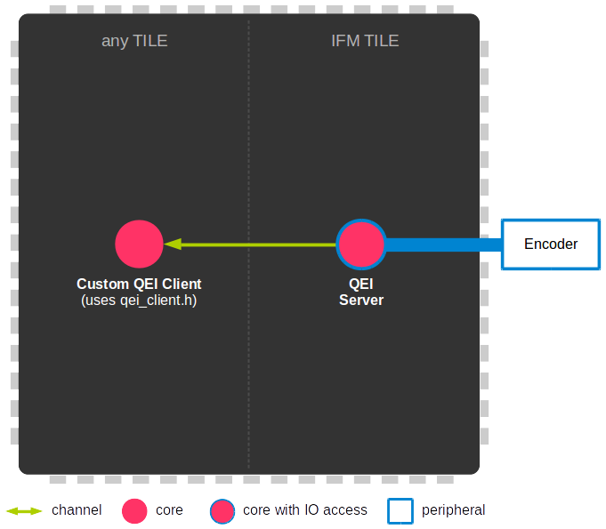

.. _module_qei:
===============================================
SOMANET Encoder Interface Module
===============================================

.. contents:: In this document
    :backlinks: none
    :depth: 3

This module provides a Service that will read and process the data coming from your 
Incremental Quadrature Encoder Feedback Sensor. Up to 5 clients could retrieve data from the Service
through an interface.

When running the QEI Service, the **Reference Frequency** of the tile where the Service is
allocated will be automatically changed to **250MHz**.

The Hall Service should always run over an **IFM tile** so it can access the ports to
your SOMANET IFM device.

.. cssclass:: github

  `See Module on Public Repository <https://github.com/synapticon/sc_sncn_motorcontrol/tree/master/module_qei>`_

How to use
==========

.. important:: We assume that you are using :ref:`SOMANET Base <somanet_base>` and your app includes the required **board support** files for your SOMANET device.
          
.. seealso:: You might find useful the :ref:`Encoder Interface Test <qei_demo>` example app, which illustrates the use of this module. 

1. First, add all the :ref:`SOMANET Motor Control <somanet_motor_control>` modules to your app Makefile.

    ::

        USED_MODULES = module_qei module_pwm_symmetrical module_adc module_ctrl_loops module_hall module_misc module_motorcontrol module_profile module_watchdog module_board-support

    .. note:: Not all modules will be required, but when using a library it is recommended to include always all the contained modules. 
          This will help solving internal dependancy issues.

2. Include the Encoder Service header **qei_service.h** in your app. 

3. Instanciate the ports where the Service will be reading the Encoder Sensor feedback signals. 

4. Inside your main function, instanciate the interfaces array for the Service-Clients communication.

5. At your IFM tile, instanciate the Service. For that, first you will have to fill up your Service configuration.

6. At whichever other core, now you can perform calls to the Encoder Service through the interfaces connected to it.

    .. code-block:: C

        #include <CORE_C22-rev-a.bsp>   //Board Support file for SOMANET Core C22 device 
        #include <IFM_DC100-rev-b.bsp>  //Board Support file for SOMANET IFM DC100 device 
                                        //(select your board support files according to your device)

        #include <qei_service.h> // 2

        QEIPorts qei_ports = SOMANET_IFM_QEI_PORTS; // 3

        int main(void)
        {
            interface QEIInterface i_qei[5]; // 4

            par
            {
                on tile[APP_TILE]: int foo = i_qei[0].get_qei_position(); // 6
  
                on tile[IFM_TILE]:
                /* Quadrature Encoder sensor Service */
                {
                        QEIConfig qei_config; // 5
                        qei_config.signal_type = QEI_RS422_SIGNAL;              
                        qei_config.index_type = QEI_WITH_INDEX;                 
                        qei_config.ticks_resolution = 4000;                     
                        qei_config.sensor_polarity = QEI_POLARITY_NORMAL;       

                        qei_service(qei_ports, qei_config, i_qei);
                }
            }

            return 0;
        }

API
===

Definitions
-----------

.. doxygendefine:: QEI_SENSOR

Types
-----
.. doxygenenum:: QEI_SignalType
.. doxygenenum:: QEI_IndexType
.. doxygenstruct:: QEIConfig
.. doxygenstruct:: QEIPorts

Service
--------

.. doxygenfunction:: qei_service

Interface
---------

.. doxygeninterface:: QEIInterface
